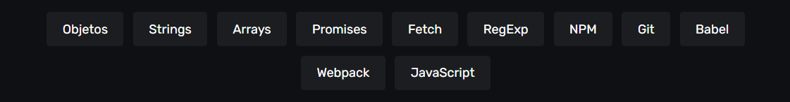

# Animais Fantásticos

This project was created during the Full JavaScript Online Course by Origamid. This was probably one of the most complete experiences I've had with learning a progamming language. Well explanation, crystal clear, covering all best practices, programming concept. Super important informations you need to learn in Javascript.

---

Este projeto foi feito durante o Curso Completo de JavaScript pelo Origamid. Provavelmente uma das experiências mais completas que já tive com o aprendizado de uma linguagem de programação. Ótima explicação, mostrando as boas práticas, conceitos sobre a programação em JavaScript. Conhecimentos super importantes de serem adquiridos em JavaScript.

O que aprendi:

:wolf::computer:
> "Making progress is part of a lifetime adventure."

:link: [Clique aqui para acessar este projeto](https://felipe-thomaz.github.io/animais-fantasticos/)

## 💛 Contato
felipe.thomaz@fatecitapetinga.edu.br
